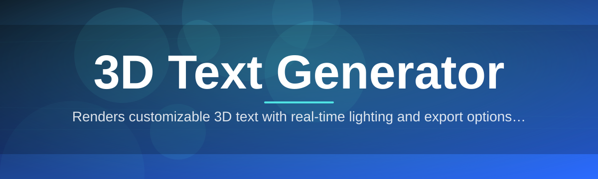
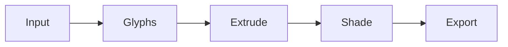

# 3d-text-editor 🔤✨

  

*Type a word, watch it grow depth, light, and motion — 3D typography in seconds, not hours.*

  

---

## 🌐 Overview

**3d-text-editor** turns flat words into dimensional objects. Type a string, pick a typeface, and the engine extrudes it into a real 3D mesh you can rotate, light, texture, and export — no modeling software, no rigging, no waiting on render farms. What used to require a 3D suite and a tutorial rabbit hole now takes one input box and a slider.

The 3D Text Generator space has always had a gap: heavyweight DCC tools (Blender, Cinema 4D) do this beautifully but demand a learning curve most people never want to climb, while browser-based "3D text" gimmicks are toys — low-res, laggy, and impossible to export cleanly. This project sits in the middle: a focused, native Windows app built for one job, done properly.

It's for streamers who need a title card in five minutes, game devs prototyping logo treatments, designers mocking up signage, students building portfolio pieces, and anyone who has ever typed a word into Word Art and wished it had actual geometry. If your job touches branding, motion graphics, or thumbnails, this tool earns a permanent spot on your taskbar.

## 📥 Get Started

> [!TIP]
> Bookmark the landing page — it always points to the current build, so you never chase old versions.

---

## 🚀 Capabilities That Actually Matter

- **Real-time extrusion** — text becomes geometry instantly as you type, with live bevel and depth adjustment, not a "render preview" you wait on.

- **Physically-based materials** — chrome, glass, brushed metal, matte plastic — apply real PBR shaders instead of flat color fills.

- **Dynamic lighting rigs** — drop in three-point, studio, or neon rim setups with one click; drag lights freely in the viewport.

- **Font-to-mesh pipeline** — loads any installed TrueType/OpenType font and converts glyph outlines into clean, watertight 3D meshes.

- **Camera choreography** — orbit, dolly, and keyframe camera moves for quick turntable renders without a timeline degree.

- **Export flexibility** — output PNG stills, transparent-background frames, or OBJ/FBX meshes for use in other pipelines.

- **Scene presets** — "Neon Sign," "Gold Foil," "Sci-Fi HUD" and more, one-click starting points instead of blank-canvas paralysis.

- **Non-destructive layers** — stack multiple text objects, each with independent depth, material, and transform, composited live.

> [!NOTE]
> Every capability above runs locally on your GPU/CPU — nothing is uploaded, queued, or rendered remotely.

---

## 🧭 How to Get Started

1. Open the landing page via the download button above.

2. Grab the latest Windows build — a single self-contained package.

3. Launch the executable directly; no setup wizard, no background services.

4. Type your text, pick a preset, and drag the depth slider — you're already looking at a 3D result.

---

## 🖥️ Requirements Matrix

| Component | Minimum | Recommended |
|---|---|---|
| **OS** | Windows 10 (64-bit) | Windows 11 (64-bit) |
| **RAM** | 4 GB | 8 GB+ |
| **Disk** | 250 MB free | 1 GB free (for exports/cache) |
| **GPU** | DirectX 11 compatible | Dedicated GPU with 2GB+ VRAM |

> [!IMPORTANT]
> This is a standalone Windows application. No runtime installs, no external dependencies, no internet connection required after download.

---

## ⚙️ How It Works

The pipeline is deliberately linear — no hidden background jobs, no cloud round-trips.

1. **Input parsing** — your typed string and chosen font are read and mapped to glyph outlines.

2. **Vector extraction** — each glyph's vector path is cleaned and triangulated.

3. **Mesh extrusion** — flat paths are pushed into 3D depth with bevels calculated per edge.

4. **Shading pass** — materials and lights are applied to the live mesh in the viewport.

5. **Output** — the scene is exported as an image or a portable 3D mesh file.

---

## 🛟 Troubleshooting

<strong>My text looks flat, not 3D — what's wrong?</strong>

The depth slider defaults near zero on first launch. Increase the extrusion depth value in the right-hand panel — the mesh updates live.

<strong>A custom font I installed doesn't show up in the list.</strong>

Only fonts registered with Windows at the OS level are detected. Reinstall the font via Windows Settings > Fonts, then restart the app.

<strong>Exported OBJ opens with missing textures in Blender.</strong>

OBJ exports carry geometry and UVs, not baked material images. Re-apply PBR materials inside your target app, or export a PNG render instead if you just need a still.

<strong>The viewport feels laggy with long text strings.</strong>

Very long strings generate a proportionally large mesh. Reduce bevel segments in Settings > Quality, or split long titles across multiple layered text objects.

<strong>Colors look washed out under certain lighting presets.</strong>

Some presets use high-intensity rim lights that can blow out mid-tone materials. Lower the light intensity slider or switch to a matte material preset.

---

## 🎨 UI / UX Details

| Shortcut | Action |
|---|---|
| `Ctrl+N` | New text scene |
| `Ctrl+S` | Save project |
| `Ctrl+E` | Export current view |
| `Space` | Toggle orbit camera |
| `Ctrl+Z / Ctrl+Y` | Undo / Redo |
| `Tab` | Toggle side panels |

- **Themes**: Light, Dark, and "Studio Black" for color-accurate render review.

- **Settings** persist per-project — depth, material, and camera state all save with your file.

- Viewport supports **grid snapping** and **safe-zone overlays** for thumbnail-accurate framing.

> [!TIP]
> Hold `Alt` while dragging the camera for fine-grained, slow-motion orbit control — useful for precise angle matching.

---

## 🤝 Contributing & Community

Bug reports, feature requests, and font-pipeline improvements are welcome via Issues and Pull Requests. Before opening a PR:

- Check existing Issues to avoid duplicates.

- Describe your change with before/after screenshots where visual.

- Keep PRs focused — one capability or fix per request.

We're building this in the open, and every report sharpens the tool for the next person typing their first word into it.

  

---

## 📄 License

Released under the [MIT License](LICENSE), 2026.

> [!WARNING]
> This software is provided "as is," without warranty of any kind. Use exported assets in accordance with your own project's licensing obligations, especially regarding font licenses.

## ⚠️ Disclaimer

3d-text-editor is an independent creative tool, not affiliated with any font foundry, game engine, or 3D modeling suite mentioned in this document. Fonts remain the property of their respective creators — ensure you have rights to use any font commercially before distributing exported work.

---

